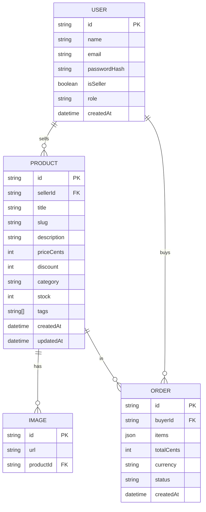

# Database Schema Diagram

```mermaid
erDiagram
    USER {
        string id PK
        string name
        string email
        string passwordHash
        boolean isSeller
        string role
        datetime createdAt
    }
    
    PRODUCT {
        string id PK
        string sellerId FK
        string title
        string slug
        string description
        int priceCents
        int discount
        string category
        int stock
        string[] tags
        datetime createdAt
        datetime updatedAt
    }
    
    IMAGE {
        string id PK
        string url
        string productId FK
    }
    
    ORDER {
        string id PK
        string buyerId FK
        json items
        int totalCents
        string currency
        string status
        datetime createdAt
    }
    
    USER ||--o{ PRODUCT : "sells"
    USER ||--o{ ORDER : "buys"
    PRODUCT ||--o{ IMAGE : "has"
    PRODUCT ||--o{ ORDER : "in"
```