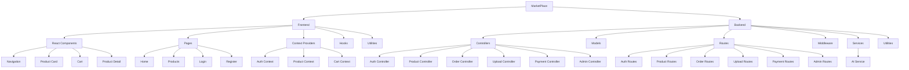

# Project Structure Diagram

```mermaid
graph TB
    A[MarketPlace] --> B[Frontend]
    A --> C[Backend]
    
    B --> B1[React Components]
    B --> B2[Pages]
    B --> B3[Context Providers]
    B --> B4[Hooks]
    B --> B5[Utilities]
    
    C --> C1[Controllers]
    C --> C2[Models]
    C --> C3[Routes]
    C --> C4[Middleware]
    C --> C5[Services]
    C --> C6[Utilities]
    
    C1 --> C1A[Auth Controller]
    C1 --> C1B[Product Controller]
    C1 --> C1C[Order Controller]
    C1 --> C1D[Upload Controller]
    C1 --> C1E[Payment Controller]
    C1 --> C1F[Admin Controller]
    
    C3 --> C3A[Auth Routes]
    C3 --> C3B[Product Routes]
    C3 --> C3C[Order Routes]
    C3 --> C3D[Upload Routes]
    C3 --> C3E[Payment Routes]
    C3 --> C3F[Admin Routes]
    
    C5 --> C5A[AI Service]
    
    B1 --> B1A[Navigation]
    B1 --> B1B[Product Card]
    B1 --> B1C[Cart]
    B1 --> B1D[Product Detail]
    
    B2 --> B2A[Home]
    B2 --> B2B[Products]
    B2 --> B2C[Login]
    B2 --> B2D[Register]
    
    B3 --> B3A[Auth Context]
    B3 --> B3B[Product Context]
    B3 --> B3C[Cart Context]
```